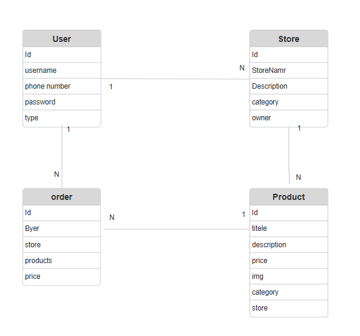

#  I haven't chosen a name yet

The platform (I haven't chosen a name yet) brings together shops that sell handmade items—such as wedding favors, *Nasfa* treats, gifts for welcoming newborns, artwork, and other handcrafted goods—making it easier for buyers to find them without having to spend a long time searching on social media.

## 1.user stories

### Visitors

| ID  | User story                                                                                                                                       |
| --- | ------------------------------------------------------------------------------------------------------------------------------------------------ |
| U01 | As a visitor, I would like to browse the available stores to find the product I want.                      |
| U02 | As a visitor, I would like to filter products by type and price so that I can find what suits me.                       |
| U03 |As a visitor, I would like to view the product images, price, and description so that I can see the important details. |
| U04 |As a visitor, I would like to create a store or buyer account so that I can use the platform. |
| U05 | As a user, I want to sign in and sign out so that I can securely access my account.                                                              |
| U06 |As a user, I would like to edit my name, phone number, and other details to ensure the accuracy of my profile.                                                        |

### Buyer

| ID  | User story                                                                                                                  |
| --- | --------------------------------------------------------------------------------------------------------------------------- |
| B01 | As a buyer, I would like to view all information about the store and its products so that I can see what is currently available and what custom products I can order.                   |
| B02 | As a buyer, I want to add products to the cart so I can review them and remove anything I don't want before completing the order.                     |
| B03 | As a buyer, I would like to view my current and past orders so that I can see everything I have ordered.                        |
| B04 | As a buyer, I would like to receive invoices so I can know the value of my purchases from stores.                   |

### Store

| ID  | User story                                                                                                                                    |
| --- | --------------------------------------------------------------------------------------------------------------------------------------------- |
| S01 | As a store owner, I want to create and edit my store profile so that I can showcase my products.                              |
| S02 | As a store owner, I would like to upload, replace, or remove my business logo so that buyers can recognize it.                            |
| S03 | As a store owner, I would like to add my products, along with their prices and full details, so that all buyers can view them.                                      |
| S04 | As the owner of the store, I would like to edit the information and change the images to ensure the accuracy of its description.       |
| S05 | As a store owner, I would like to set the products to "out of stock" status.                                    |
| S06 | As a store owner, I would like to delete products when they go out of stock, provided I do not intend to restock them in the future.                        |
| S07 | As an organizer, I would like to view the list of buyer orders from my account.                    |
| S08 | As a store owner , I would like to obtain all the buyer's details and address so that I can deliver the order.                |

### Admins

| ID  | User story                                                                                                                       |
| --- | -------------------------------------------------------------------------------------------------------------------------------- |
| A01 | As an admin, I would like to view information about the stores—specifically their details and logos—so that I can identify the stores using the site for sales.    |
| A02 | As an admin, I would like to review the details regarding the number of users—specifically the number of stores and buyers—and view their data. |
| A03 | As an admin, I would like to remove stores that have recurring complaints, or buyers with recurring complaints, from the Owner Stores.           |

## Entity relationship diagrams (ERDs)

## Routes

### Accounts and stores

| Method    | Path                        | Purpose                                                                    |
| --------- | --------------------------- | -------------------------------------------------------------------------- |
| POST      | `/auth/sign-up`             | Create a Buyer or Seller account                   |
| POST      | `/auth/sign-in`             | Sign in with username, password, and selected role; return user and token. |
| GET / PUT | `/auth/me`                  | Read the current account or update personal details.                       |
| GET       | `/stores`                   | List publicly available stores.                                            |
| GET       | `/stores/mine`              | Read the current seller's store, or `null` before setup.                    |
| GET       | `/stores/:id`               | Read an approved store and its products.                                   |
| POST      | `/stores`                   | Create a new store for the seller.                                         |
| PUT       | `/stores/:id`               | Save store changes and return to Pending status.                           |
| PUT       | `/stores/:id/review`        | Admin decision with `status` and `reviewReason`.                           |
| DELETE    | `/stores/:id`               | Delete the owned store only when it has no products.                       |

### Products and orders

| Method    | Path                                | Purpose                                                                    |
| --------- | ----------------------------------- | -------------------------------------------------------------------------- |
| GET/POST  | `/productsp`                        |Public approved list of products / or create a seller draft product.        |
| GET       | `/products/mine, /products/mine/:id`| Seller list and private product detail.                                    |
| GET       | `/products/review, /products/review/:id`| Admin list and private product detail.                                 |
| GET       | `/products/purchases`               | Current buyer's purchase history.                                          |
| GET       | `/products/favorites`               | Current buyer's favorites; hidden products return an unavailable entry.    |
| GET/ PUT / DELETE| `/products/:id`              | Public detail / owner edit / delete an unused unpublished product.         |
| POST      | `/products/:id/submit`              | Submit a draft or rejected product for review.                             |
| POST      | `/products/:id/cancel`              | Cancel a published product.                                                |
| POST      | `/products/:id/complete`            | Complete a fulfilled product order with sales record.                      |
| PUT       | `/products/:id/review`              | Admin decision with `status` and `reviewReason`.                           |
| GET/POST  | `/products/:id/orders`              |PStore orders / place a new purchase order for the product.                 |
| DELETE    | `//products/:id/orders/me`          |Cancel the current buyer's purchase order.                                  |
| PUT       | `/products/:id/orders/:buyerId`     |Update order or fulfillment status.                                         |
| PUT / DELETE| `/products/:id/favorite`          |Save / remove a product favorite.                                           |
| POST      | `/uploads`                          |Seller image upload as multipart field `image`; returns `{ url, publicId }`.    |

### Store updates

| Method    | Path                           | Purpose                                                                       |
| --------- | ------------------------------ | ----------------------------------------------------------------------------- |
| GET       | `/stores/:id/updates`          | Public newest-first updates when store and owner are Approved.                |
| GET       | `/stores/mine/:id/updates`     | Owning seller's updates in every store status.                                |
| POST      | `/stores/:id/updates`          | Owner creates an update with `{ text }`; ownership IDs come from the server.  |
| PUT       | `/stores/:id/updates/:updateId`| Owning author edits an update's text.                                         |
| DELETE    | `/stores/:id/updates/:updateId`| Owning author removes an update.                                              |
